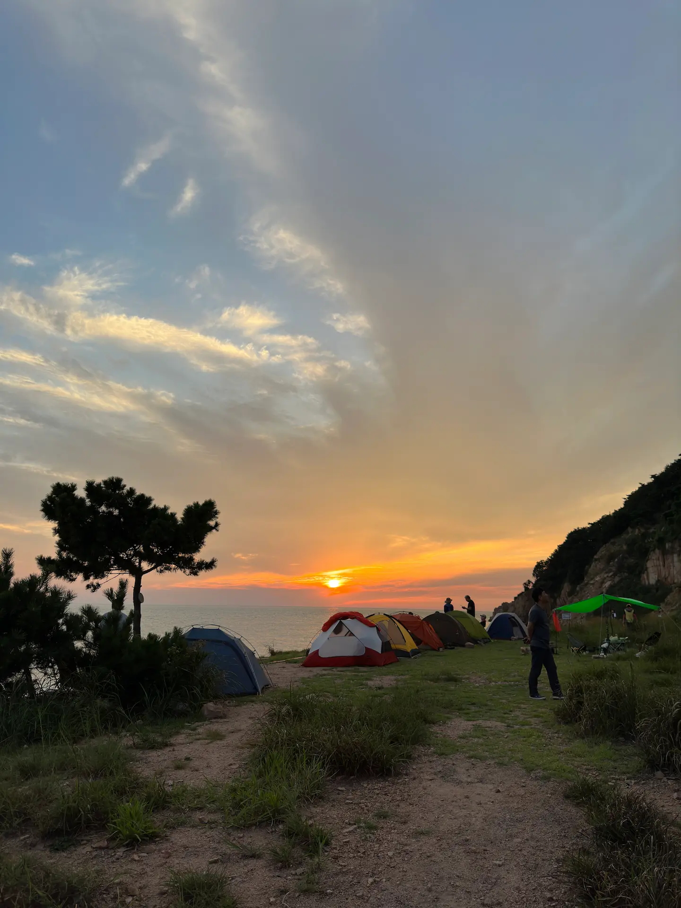

늦더위가 기승이었던 9월 초, 비온 뒤 날씨가 살짝 풀렸다. 이 때다 싶어 찾게된 무의도 무렝게티. 평소에 가보고 싶은 곳이기도 했고 마침 약속이 있었는데 동선이 너무나 깔끔하게 맞길래 고민없이 짐을 쌌다. 약속 장소는 인천 공항. 무의도로 가는 버스도 이 곳에서 출발한다. 로스 없는 동선 너무 좋구요.

> 무의도 가는 법  
> 🚌 대중교통 이용 시 : 인천공항T1(3층 7번) ↔ 광명항 정류장  
>    &nbsp;&nbsp;&nbsp; 첫 차 06:30 배차 간격 45-60분
> 시간표는 <a href="https://bus.incheon.go.kr/bis/rout.view"> 인천 버스 정보</a> 에서 확인 할 수 있다.  
> 전체 노선 현황에서 "무의1" 검색  
> 🚗 자차 이용 시 : 바다마을펜션 / 무의광명항공영주차장 이용
  
대만에서 놀러오는 친구 여자친구 분에게 부탁한 것이 있어 감사의 표시로 밥을 사기로 했는데, 이 고마운 커플은 식사 후에 친히 나를 무의도에 내려주고 먹을 것까지 잔뜩 쥐어 보냈다.  
네비로 바다마을펜션을 찍고 왔는데, 광명항 앞은 주차 공간도 적고 혼잡하니 주차는 광명항 오기 전에 있는 공영주차장을 이용하는게 좋을 것 같다. 공영주차장 쪽에도 등산로가 연결되어 있는 것으로 보인다. (등산로 표지판 있음)

##### # 안내판에 그런 곳은 없어요
{: .long-image}
  
편의점에 들러 물과 먹을 것을 충전하고 호룡곡산 등산로 입구로 향했다. 둥산로 입구는 광명항으로 들어오는 길을 되돌아 조금 올라가면 찾을 수 있다. 일단 안내판에는 표시가 되어있지 않고, 가는 길이 헷갈린다는 후기를 봤는데 어떻게 되겠지 뭐. 후기 몇 개와 나의 경험을 종합해보면 이렇다. 1. 산을 넘어 해안가를 두 번 지나면 된다. 2. 처음 만나는 해안가에서 길은 두가지! 자갈이 많지만 포토존이 있는 바닷 길, 도착 시간이 빠른 산 길. 만조에는 바닷 길이 잠긴다.   

{: .short-image}

밭과 무덤을 지나서 산행을 하다보면 보이는 뷰. 아래로 보이는 해변으로 가는 길도 있었다. 사람 적은 곳을 선호한다면 나쁘지 않을지도.
    
{: .long-image}
  
설렁설렁 가다보니 금방 마주친 첫번째 해안가. 나무 사이로 시야가 트이면서 해안가가 모습을 드러내는데, 숨겨진 장소에 발을 들인 듯한 느낌이 들었다. 급경사인 바위를 조심조심 내려와 숨을 고르면서 어디로 갈지 고민을 해본다. 바닷길은 물이 빠지는 간조 때만 이용 할 수 있으니, 그 쪽으로 가고 싶다면 반드시 물 때를 확인 해야한다. 그걸 모르고 갈 때는 산 길, 돌아올 때 바닷길로 가야지 라고 생각했던 나는 돌아오는 날 잠겨버린 바닷길을 보고 적잖이 당황했다.  
산 길은 해안가 끄트머리에 있는데, 처음부터 경사가 급해 헥헥대며 올라갔었던 것 같다. 그렇게 고개를 넘어 두 번째 해안에서 조금 더 깊이 들어가면 어렵지 않게 세렝게티에 도착할 수 있었다.  

##### # 잔잔한 파도와 깍아지른 바위산, 기분 좋은 바람까지
{: .short-image}  
  
예상대로 이미 많은 분들이 와계셨다. 대부분 바다 근처에 자리를 잡았고 특히 일몰이 보이는 제일 안쪽은 단체로 온 분들이 있었다. 길을 따라 제일 안 쪽까지 몇 번 왔다갔다 하며 자리를 가늠해 보다가 붐비는 것이 싫어 길 안쪽의 바위산 밑에 자리를 잡기로 했다. 사람 키 높이의 수풀로 들어가기 전 아가 나무로 빙 둘러진 공간이 좋아보였다. 
{: .short-image}

텐트를 치기 전 바다 쪽에서 바라본 바위산은 아담하지만 평평한 지대에 불쑥 솟아있어 새삼 웅장해보였다. 탁 트인 바다 전망이 없어 아쉽긴 했지만 곧 해가 지면 이 쪽이 더 조용하고 광해도 덜 것 같았고, 산을 배경으로 텐트 사진을 남길 수 있다는 점도 장점이었다. 

{: .short-image}

짜잔! 생각보다 멋진 구도가 나와서 대만족. 산을 최대한 나오게 하려다 보니 나무가 기괴하게 휘어버리고 텐트가 조막만해졌다. 사진 몰라요~ 😋

{: .short-image}
  
바다는 이렇게 단단히 막힌 뷰였지만, 바위에 잠깐 올라가서 보고 오는 것 만으로도 충분했다. 
  
##### # 평화로운 
{: .long-image}
{: .long-image}
{: .long-image}

##### # 일몰 
{: .long-image}
{: .long-image}
{: .short-image}

{: .long-image}
{: .long-image}
{: .short-image}

##### # 돌아가는 길에 

{: .short-image}

{: .long-image}
{: .long-image}