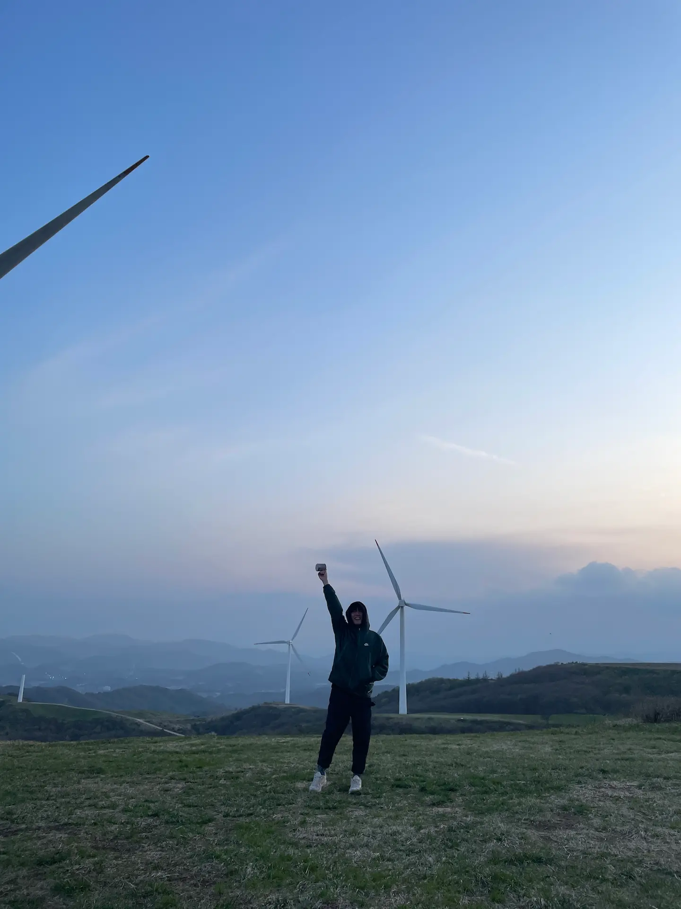
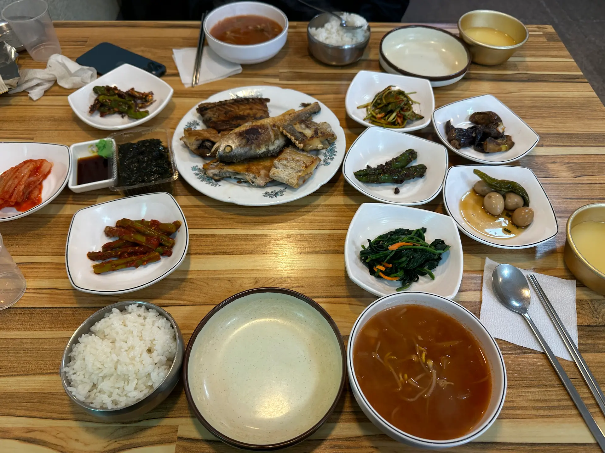

##### # 절대 밖으로 나가야만 하는 날씨
특별한 계획없이 집에서 푹 쉬어야 겠다는 생각으로 맞이한 연휴 첫 날, 날씨가 얼마나 좋던지 집 앞 편의점에 다녀오는데도 기분이 좋아졌다. 거실 창을 활짝 열고 의자를 젖혀 앉아 볕을 쐐다가 문득 절대 지붕 아래 있어서는 안되겠다는 생각이 들었다. 뭘 하면 좋을까 고민 끝에 올해 백패킹을 개시 해보기로 했다. 행선지를 정하는데에는 오랜 시간이 걸리지 않았다. 초보 백패커에게는 안 가본 곳이 아주 많기 때문에 :D "뚜벅이 선자령 후기"를 찾아보고 횡계로 가는 시외버스를 예약했다.    
 
##### # 3대 백패킹 성지, 대관령 선자령으로
> 🚌 대중교통 선자령 가는 법 : 횡계 터미널 ↔ 대관령 휴게소  
>    &nbsp;&nbsp;&nbsp;횡계 터미널 → 대관령 휴게소 : 09:00 / 10:10 / 11:15 / 14:00  
>    &nbsp;&nbsp;&nbsp;대관령 휴게소 → 횡계 터미널 : 09:20 / 10:45 / 11:45 / 12:20 (*2024.02월 기준)  
> 시간표는 <a href="https://bus.pc.go.kr/schedule"> 평창군 버스 정보 시스템</a> 에서 확인 할 수 있다.  
> "대관령마을휴게소, 대관령양떼목장"or"440번" 검색  
    
{: .long-image}
  
양떼 목장을 오고가는 시내 버스는 하루에 단 네 대. 시간표 확인은 필수!  
모두 오후 2시 이전에 운행 종료되는 것도 참고  
점심 먹고 쉬엄쉬엄 올라가도 되겠다 싶어서 횡계발 14:00 버스를 타겟으로 정했다. 동서울에서 횡계까지 예상 소요 시간은 2시간 반. 10:35분 차를 타면 1시 전후로 도착해서 점심을 먹으면 될 것 같았다.  
  
##### # 터미널 앞 국수집, 원칼국수
{: .short-image}
    
예정보다 조금 지연되어 횡계 터미널에 도착, 시간이 살짝 타이트 한가? 싶었다. 터미널 안 편의점에서 이것저것 주워 담은 후 다시 시간을 확인하니 남은 시간은 30분 남짓.어쩌지.. 고민하고 있던 그 때, 같은 버스에서 내린 백패커 커플이 정류장 앞 칼국수 집으로 들어가는 것을 보았다. 그럼 나도 고!  
식당 안에는 식사 시간이 조금 지났는데도 손님들이 있었다. 오가는 말을 들어보니 동네 분이셨는데 동네 맛집인 걸까. 주문이 밀려있는 듯 해서 조금 걱정스러웠는데 괜한 걱정이었다. 역 앞의 국수집답게 칼국수는 금방 나왔다. 갓 나온 국수를 시간에 쫒겨 허겁지겁 먹는데 주인 할머니께서 살갑게 말을 걸어주셨다. 오랫동안 이 곳에서 가게를 운영하고 있다고 하셨는데, 짧은 몇 마디의 대화에서도 따뜻함이 느껴져서 기분이 좋았다. 역전 국수집의 푸근함과 따스함에 다음에도 방문하게 될 것 같다.

##### # 휴게소에서 정상까지
{: .short-image}
   
호다닥 식사를 하고 나오자 기다렸다는 듯이 버스가 들어왔다. 종점인 대관령마을 휴게소까지는 20분 정도 걸린 듯. 휴게소 건물 사이로 양떼목장 가는 길이 있는데, 그 곳을 지나쳐 풍력발전기가 보이는 방향으로 조금 더 올라 가다보니 등산로 입구를 알리는 표지판이 보였다. 
  
{: .long-image}
   
{: .long-image}
 
국사성황사와 전망대를 지나 선자령까지는 단 4km. 부담 없는 거리에 발걸음이 가볍다. 휴게소 초입의 풍력 발전기를 뒤로하고 산행을 시작했다.
  
{: .long-image}
 
등산로 초입은 이렇게 흙 길. 이 때만 해도 나무가 길쭉길쭉한 것이 여느 곳과 비슷했군. 
   
{: .long-image}
   
발길 닿는대로 걷다보니 어느새 포장 도로를 걷고 있었고 눈 앞엔 이상한 구조물이 보였다. KT송신탑 인가보다 했는데 맞았다. 정상에 도착하고나서야 전망대를 그냥 지나쳤다는 것을 깨달았는데, 본능적으로 오르막-내리막을 피해 편한 길을 찾아 다닌 것 같다. 전망대를 못가서 좀 아쉬웠는데, 돌아올 때 올라가면 된다고 생각했지만 결국 시간에 쫒겨 가지 못했다. P의 여행에선 이게 일상이야~
  
{: .long-image}
  
산을 조금씩 오르니 하늘이 많이 보이면서 나무들의 키가 점점 작아지는 것이 느껴졌다. 세상에 나만 삐뚤어진 사람인 냥 모든 나무들이 한 쪽으로 누워 있는데, 바람이 얼마나 불면 얘들이 이렇게 자라났나 싶었다. 그러고 보니 바람이 점점 거세지고 있었다.
  

##### # 유튭에서 보던 것과 많이 달랐던 텔레토비 동산
바람을 막아주던 관목들이 작아지다가 종국에는 사라지더니 여기 저기에 설치된 풍력 발전기가 보이기 시작했다. 정상이 가까워졌다는 생각에 발걸음이 가벼워 졌다. 아닌게 아니라 정말 가벼워 진건가..? 종종 걸음으로 가다가 갑자기 몸이 휘청했다. 누가 그렇게 치고 갔으면 크게 기분이 상했을텐데, 바람에 치였더니 어이가 없어 웃음이 나왔다. 자세를 낮추고 걸어도 바람이 강해서 몇 번씩 걸음을 멈췄다. 이거 맞아?  
비슷한 고개를 한 두 개 더 넘으니 탁 트인 넓은 언덕이 나왔다. 누가 봐도 여기가 그 텔레토비 동산이었다. 넓직한 잔디밭과 경사면을 따라 내려다 보이는 다른 언덕들. 그런데, 분위기가 좀 이상했다.
  
{: .long-image}
   
노랑 빨강 예쁜 텐트가 여기저기 있어야 할 언덕에는 텐트 한 동 보이질 않고, 힘차게 돌아야할 터빈은 날개 하나가 똑 부러져 멈춰있었다. 무엇보다 아무도 없었다. 
이게.. 뭐죠? 😲
  
{: .long-image}

황망한 표정으로 어마무시한 바람이 부는 언덕을 그대로 지나쳐 정상비 쪽으로 향했다. 일단 왔으니까 사진은 찍어야지~ 사진 부탁할 사람 하나 없으니 어쩌죠? 어쩌긴 그냥 비석만 찍었다. 
  
{: .short-image}

먼저 올라간 다른 분들은 어디 가신걸까, 여기저기 기웃거리다가 저 멀리 전망대가 보였다. 줌으로 최대한 땡겨서 저쪽엔 사람이 있나? 하고 봤지만 역시나 없다.  
어쩌지 어쩌지 하면서 동산으로 돌아왔는데 별 수가 있나. 일단 앉아서 생각해 보기로 했다.  

##### # 뒷 모습이 너무 멋지신데 사진 하나 찍어드릴까요?
  
{: .long-image}
  
돌아서서 다시 부러진 터빈 쪽으로 왔는데, 같은 버스를 타고 온 커플이 보였다. 언덕의 바람을 피해 입구 쪽의 바위에 배낭을 놓고는 어떻게 할 지 이야기 하는 것 같더니 이내 왔던 길로 내려갔다. 자 이제 나는 어떡하면 좋을까. 집가는 표를 사야하나, 생각하고 있을 때 등 뒤에서 누군가 말을 걸어 왔다.  
"뒷 모습이 너무 멋지신데 사진 하나 찍어드릴까요?"  
생각이 많아져 심란해진 그 때의 나는 괜찮습니다 하고 거절했는데, 사실 멀리서 나를 발견하고 다가오면서 이미 사진을 찍어뒀다는 걸 나중에 알게 되었다. 너무 감사합니다.  
후에 이름을 알게된 J님은 바람이 적은 곳에 텐트를 쳤는데, 주변에 자리가 많으니 원한다면 안내를 해준다고 했다. 함께 이동하면서 새삼 내가 누군가에게 선뜻 먼저 호의를 베풀었던 적이 언제인지 생각해 봤다. 부끄러움과 동시에 더더욱 그의 호의가 고마워졌다.
  
##### # 바람이 적은 곳이 아니고 야생화 꽃천지인데요
텔레토비 동산에서 정상비로 가는 길 오른쪽 편에는 작은 샛길이 있었다. 초입은 휴지가 많이 보여서 무슨 일이 있었는지 상상하기 싫은, 텐트를 치기는 더더욱 싫은 곳이었다. 그러나 조금 더 들어가니 휴지도 없고 바람도 점점 잦아들어서 텐트를 치기 적당한 곳이 많았다. 적당한 장소를 살펴 텐트를 치려고했더니 예쁜 꽃들이 눈에 들어왔다.  

{: .short-image}

{: .long-image}
  
나이가 들어서 그런가 꽃을 보면 새삼 예뻐서 사진을 찍게 된다. 어쩜 이렇게 작은 꽃도 꽃잎이 있는지, 바람에 살랑거리는게 꼭 아가 손가락 같아 한참을 보다가 살짝 한기가 느껴져 서둘러 텐트를 쳤다.  

{: .short-image}
  
텐트를 치고나서는 푹 쉬었다. 꽃도 마저 보고, 요기도 좀 했다. 의자에 앉아서 하늘을 보니까 나름 운치가 있어서 한 컷.
  
{: .long-image}
  
일몰을 보러 J님과 함께 길을 나섰다. 쉬면서 중간중간 바람이 멎었는지 언덕에 나가보곤 했는데, 이때 쯤에서야 비로소 이사를 포기하게 되었다. 언덕은 여전히 바람이 심했다. 머리까지 덮어쓴 바람막이가 펄럭거리며 쉴새없이 귀를 때렸고 추위에 들고 간 밀크티가 금새 식어버렸다. 구름에 가려 일몰도 그저그랬고 너무 추워서 빠르게 철수했다. 
  
{: .short-image}
  
돌아가는 길에 J님이 같이 술 한 잔 하자고 했다. 너무 좋지요. 🤗 돌아와서 먹을 것과 술을 챙겨 나서는데 가진 게 편의점 오뎅과 육포 밖에 없어서 민망했다. 사람 좋은 J님은 가진 것도 많아서 또 한 번 신세를 지고말았다. 얘기는 재밌었다. 무엇보다 백패킹이라는 공통의 취미가 있어서 말이 잘 통했던 것 같다. 덕분에 서울 근교에 괜찮은 박지도 많이 알게되어서 까먹지 않으려 몇 번이고 중간중간 메모를 했다. 이렇게 백패킹 중에 새로운 사람을 만나 술 한잔 하는 게 처음 이었는데 나름 재밌고 즐거웠다. 
  
{: .short-image}
  
자리를 정리한 후 언덕에 한 번 더 가보기로 했다. 날이 좋으면 예쁜 텐풍을 볼 수 있었을텐데. 아쉽지만 별 수 없이 다음을 기약해 본다.  
  
{: .long-image}
  
자러 들어가기 전 달빛이 너무 예뻐서 추위에 덜덜 떨며 텐트를 중심으로 몇 장 찍었다. 역시나 제대로 된 사진이 없다. 그래도 그 것 나름 그 때의 분위기와 추위가 느껴져서 맘에 든다. 기분좋은 취기에 잠이 솔솔 왔다.
  
##### # 이 곳 선자령에서 가장 좋았던 순간
  
{: .long-image}
  
새벽녘에 우박이 떨어지는 소리에 잠이 깼다. 무서울 정도로 떨어지다 말다를 반복했는데, 그 소리가 꽤 듣기 좋아 이내 다시 잠이 들었다. 다시 눈을 뜨니 하늘이 밝았다. 텐트를 열었더니 눈앞에서 구름위로 해가 올라오고 있었다. 침낭에서 나오지 않고 애벌레인 채로 일출을 보니 편하고 좋았다.
  
{: .long-image}
  
해가 어느정도 올라오니 주변이 보이기 시작하면서 숨이 멎을 정도로 예쁜 꽃이 보였다. 갸냘픈 연보랏빛의 꽃은 고개를 잔뜩 숙이고 간밤의 우박을 쫄딱 맞아 언 몸을 바르르 떨고 있었다. 그런 모습이 애처롭다가도 어딘지 모르게 경외감이 들어 하염없이 그 조그만 것을 보고 또 보았다.
  
{: .short-image}
    
내려가기 전 몸도 풀겸 정상비까지 산책을 했다. 출발할 때에는 구름 때문에 세 걸음 앞도 안보일 정도로 주변이 뿌얬었는데, 돌아오니 언제 그랬냐는듯 했다. 산 위의 날씨는 종잡을 수가 없다.
  
{: .long-image}
  
텐트 걷기 전 한 컷.
  
{: .long-image}
  
하산 길도 J님과 함께했다. 행선지가 같아 어제 함께 표를 예매했다. 내려가서 아침도 같이 먹기로.  
다음에 또 올게요. 잘 있다 갑니다.
   
{: .long-image}
    
내려가는 길에 본 은방울꽃. 푯말이 있어 무슨 꽃인지 알게 되었는데, 꽤나 잘 어울리는 이름이네 싶었다. 
    
##### #가정식 백반 그런데 생선을 곁들인, 가정식 집밥
{: .short-image}
  
예상보다 일찍 휴게소로 내려와 첫 차를 탈 수 있었다. 아침은 횡계 터미널 근처 생선 구이 백반집 도전! 평소라면 먹을 일이 없는 신기한 반찬들이 많아 하나씩 맛보는 재미가 있었다. 아마도 김치도 강원도 식인지 슴슴하니 좋았다. 생선도 많이 주시고 아무튼 시골은 인심이 좋아.
지역 막걸리도 한 잔 했다. 오대산 찰옥수수 생 막걸리. 어땠는지 기억이 가물가물하다. 신맛이 강해서 내 취향은 아니었던 것으로. 정말 상호명에 충실한 집.

##### #마무리 
  
{: .short-image}
  
시간이 생각보다 많이 남아서 뭘 할까하다가, 텐트를 좀 말리면 좋겠다 싶어 커피를 들고 넓은 공터를 찾았다. 나른한 오전, 텐트도 나도 또똣한 볕에 노릇노릇 구워졌다. 강풍, 야생화와 함께한 선자령 백패킹 끝!