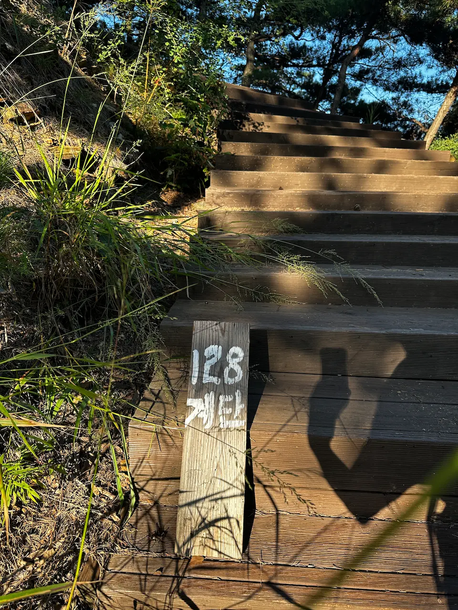
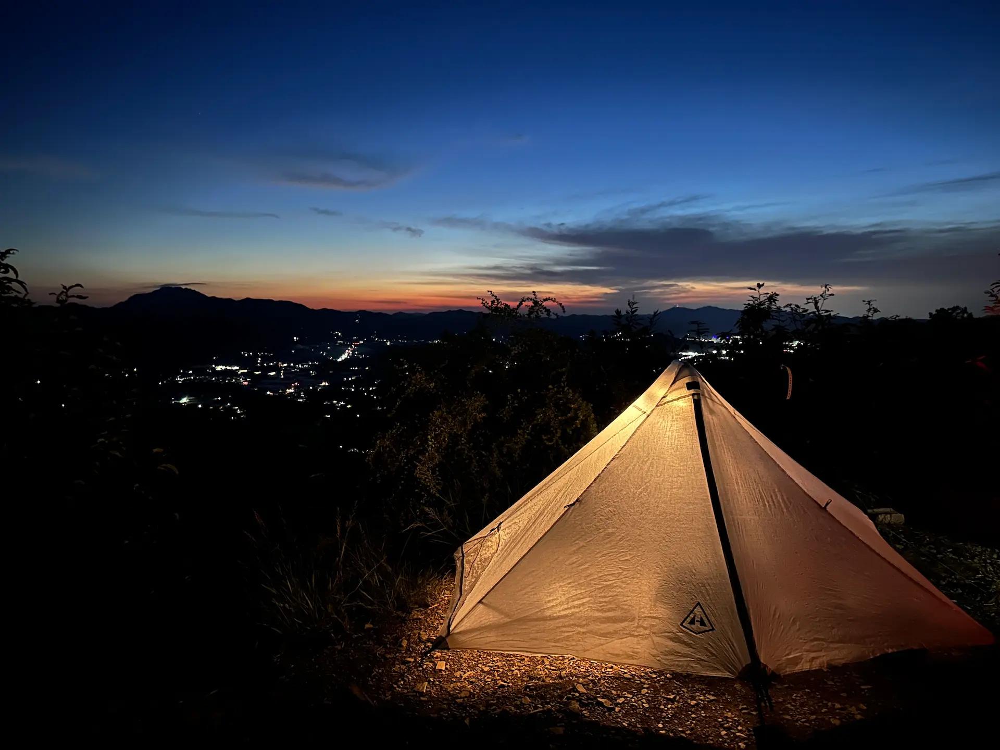

##### # 열심히 놀겠다는 다짐
선선한 날씨와 부쩍 높아진 하늘이 출근길마저 설레게 하던 가을날, 서울 근교를 벗어나 멀리 떠나고 싶어졌다. 그래서 찾게 된 옥천 어깨봉. 일교차가 큰 가을에는 운해를 볼 수 있다기에 부푼 맘으로 여정을 시작했다.   

가는 길에 친구를 만나 점심을 먹기로 했다. 그렇게 대전에서 만난 오랜 친구 H. 밥을 먹으면서 근황을 물었는데 졸업 요건을 채워 내년에는 졸업을 할 수 있다고 한다. 6년제 학부에 박사까지 총 12년. 문득 내가 10년 넘게 꾸준히 해온 일이 있었던가 되돌아보니 새삼 그의 시간이 무겁게 느껴졌다. 이렇게 노는 것 만이라도 꾸준히 남겨보자고 다짐해본다.  
  
{: .short-image}
  
놀고먹다 보니 세 시가 넘어 옥천으로 가는 무궁화호 열차를 탔다. 대전역에서 옥천역 까지는 단 12분. 느리게 변하는 풍경이 지루해지기 전 열차가 멈췄다.
  
{: .short-image}
  
옥천역 도착. 하지만 주변을 돌아볼 틈은 없었다. 하루 단 네 대만 운행하는 시내버스를 타기 위해 달려야 했기 때문이다. 열차가 멈추기 직전 실시간 정보를 확인하니 버스는 도착 3분 전. 평소 같았다면 느긋하게 다음 차를 기다렸을 텐데 다음이 없는 이런 경우는 뛸 수밖에. 심호흡을 하고 정류장을 향해 뛰었다. 뛰기 전 빠르게 한 컷.     

##### # 뚜벅이는 계획을 철저히 세워야
{: .long-image}
  
역에서 정류장 까지는 생각보다 멀지 않아 가까스로 세이프. 하지만 저녁으로 먹을 것을 사지 못했다. 어째야 하나 싶어 지도를 봤는데, 다행히 정류장 근처에 금강 휴게소가 있었다. 버스를 내려 금강 휴게소에 들르기로 결정. 청량한 바람을 맞으며 한숨 돌리는 사이 버스는 구불구불한 국도를 따라 교외로 향했다.

> 어깨봉 가는 법 : 옥천옻문화단지소형주차장   
> 🚌 대중교통 이용 시 : 옥천역에서 시내버스 이용   
> &nbsp;&nbsp;&nbsp; 541번 서울정형외과앞 ↔ 조령리 (45분 소요, 하루 4회 운행)  
> 🚗 자차 이용 시 : 옥천옻문화단지소형주차장 이용
  
{: .short-image}
   
조령리 정류장까지는 40여분 정도 걸렸다. 자차로 20분이 채 걸리지 않는 거리를 이 마을 저 마을을 거쳐 오니 그럴 수밖에. 오늘과 같이 시간이 촉박할 때면 자차의 존재가 절실하다. 이가 없으면 잇몸으로, 차가 없으면 두 다리로. 다리야 힘을 내줘.  
  
금강 휴게소는 경부 고속도로 아래 연결로를 따라 들어갈 수 있었다. 서둘러 편의점을 둘러봤는데 이게 무슨 일이야. 살 만한 것이 없다시피 했다. 어묵 팩이나 레토르트 야식을 사려고 했는데, 아무래도 휴게소에서는 잘 팔리지 않나 보다. 어쩔 수 없이 푸드 코트에서 햄버거를 샀다. 

{: .short-image}
  
휴게소에서 볼 수 있는 금강 뷰. 물살이 제법 빠르다. 대청호 보다 더 상류 쪽이니 그럴 만하다. 산 위에서 보는 게 더 예쁠 것 같아 미련 없이 등산로로 출발.  

{: .long-image}
  
왔던 길을 돌아 정류장 쪽으로 걸었다. 인도가 없으니 갓길로 조심조심!  

{: .short-image}
  
등산로 초입에 다다르면 이렇게 고속도로와 국도 사이의 주차장이 나온다. 아마도 예전 도로를 주차장으로 활용 중인 듯. 잠깐이지만 블록을 넘어 안전하게 걸었다.
  
##### # 어깨산 정상과 하늘 전망대로
{: .short-image}
  
주차장 맡은 편에 공터가 등산로 입구다. 이렇게 화장실이 있으니 참고. 등산 안내도 뒤 경사로를 따라 올라가면 된다.  

{: .long-image}
  
어깨산 정상 까지는 1.5km 그다지 멀지 않은 걸?  

{: .long-image}
  
마음이 급해서 페이스를 올린 탓인지 등산로를 들어온 지 얼마 지나지 않아 숨이 찼다. 그래서 중간중간 숨을 고르면서 올라온 길을 돌아보았다. 오를 때는 그렇게 깎아지는 경사처럼 느껴지던 등산로가 거짓말처럼 완만해 보였다. "지나고 보면 별 거 아니더라."를 몸으로 배운 느낌이었다.  

{: .long-image}
  
금강 전망대부터는 비교적 완만한 능선을 따라 이동했다. 어느새 도착한 어깨 갈림길. 임도 주차장에서 출발하면 더 짧은 산행이 가능할 것 같다. 다음에 차로 올 때에는 저 쪽에서 출발해보기로.  

{: .long-image}
  
조금 더 올라가니 계단이 나왔다. 정말 128단인지 세면서 올라가니 금방 도착했다. 종종 이런 걸 직접 확인해보고 싶을 때가 있는데, 나만 그런가?

{: .short-image}
  
가파른 구간을 한 번 더 지나면 어깨정이 나온다. 근사한 정자는 아니고 지붕이 있다 정도. 조망이 나쁘진 않지만 정상과 하늘전망대 쪽보다는 덜하다. 만약 두 곳 모두 텐트 칠 곳이 없다면 생각해 볼만 한 곳.

{: .long-image}
  

{: .short-image}
  
구불구불 흐르는 금강 줄기와 겹겹이 서 있는 산들이 발아래로 펼쳐진다. 그림 같은 풍경을 멍하니 구경하다가 두 분이 피칭을 준비하고 계셔서 배낭을 놓아둔 정상으로 돌아갔다.

##### # 정상에서의 하룻밤  
{: .long-image}
  
서둘러 텐트를 치고 밥 먹을 준비를 했다. 소주에 햄버거라, 이 조합을 시도해 본 적이 있었나? 해가 지는 방향으로 테이블을 놓고 잠깐 배낭에서 랜턴을 꺼내오는데 달이 보였다.  

{: .short-image}

달이 너무 예뻐서 자리를 옮겼다. 배고픔도 잊고서 이렇게 저렇게 달을 찍었는데 눈에 보이는 만큼 담기지 않아서 속상했다.     

{: .long-image}
  
그래도 그중 가장 마음에 드는 사진. 구름 한 점 없는 높은 하늘에 달 하나 덩그러니. 만족스럽게 식사 시작. 햄버거 소주 궁합이 괜찮다. 역시 완전식품.   

{: .long-image}
  
저 쪽에서 해가 떨어지기 시작했다. 산에 오면 좋은 점 중 하나, 일몰을 보면 오늘 하루 열심히 산 것 같은 느낌이 든다는 점.  

{: .long-image}
  
하늘이 가장 붉었던 순간 하늘이 목성 고리 같아서 한 컷. 저 멀리 기지국에서는 어떤 하늘이 보일까.  

{: .short-image}
  
텐트에 조명을 켜두고 한참 동안 풀벌레 소리를 들었다. 벌레가 꼬이는 건 싫은데 풀벌레 소리는 그렇게 좋을 수가 없다. 귀뚜라미 소리가 가을밤을 채웠다. 완벽한 하루끝. 
  
자러 들어가기 전 주변을 돌아보니 급격히 떨어진 온도에 이미 강가를 따라 운해가 올라오고 있었다. 바람이 강하면 운해가 흩어져 사라진다는 얘기를 어디선가 들었다. 밤 사이 바람이 강하지 않기를 기도하며 잠이 들었다.  
   
##### # 나는 운이 좋았지
{: .short-image}
  
우와, 하는 소리에 잠이 깨 헐레벌떡 텐트 밖으로 나왔다. 눈앞에 펼쳐진 광경에 나 역시 우와ㅏㅏㅏ가 절로 나왔다. 먼저 나와 계신 분들과 인사를 하고 다시 서로 우와우와 했다.

{: .short-image}

생각보다 운해가 두터워 어제 보이던 산들이 대부분 운해에 묻혔다. 여기저기 정수리만 간신히 내민 산들. 운해가 바람을 타고 산마루 이쪽저쪽을 흘러가는 모습이 신기했다. 

{: .short-image}
  
산 꼭대기가 꼭 바다 위의 섬 같다. 그래서 운해구나. 텐트를 걷고 짐을 정리했다. 흔적을 남기지 않기, 함께 해요 LNT. 정리를 하면서 옆에 계신 분과 몇 마디 나누었는데, 이렇게 멋진 운해는 손에 꼽는다며 운 좋은 줄 알라고 하셨다. 예 맞아요. 저는 운이 좋아요😊. 

{: .short-image}
  
어느새 해가 구름 위로 올라왔다. 이제는 하산할 시간. 잘 있다 갑니다.  

##### # 하산 중 만난 귀인
  
넋을 놓고 운해를 보다가 출발해야 할 시간을 훌쩍 넘어 하산길에 올랐다. 이번 여정은 공교롭게도 짐만 메면 마음이 조급해지네. 산을 감고 있는 운해로 가시거리가 매우 짧아 열댓 걸음 앞도 잘 안보였다. 잰걸음으로 하산 시작.

{: .long-image}
  
다시 만난 128 계단. 어제는 저 멀리까지 보였는데 온 세상이 뿌옇다.   
  
{: .long-image}
  
그 와중에 잘 보이는 것이 있으니 그것은 거미줄. 습기를 잔뜩 맞아 물방울이 방울방울 달려 있다. 거미줄이 이렇게나 크구나, 벌레가 안 잡힐 수가 없겠다 싶었다. 

{: .long-image}
  
속도를 높여 내려가니 먼저 내려가시던 분들을 앞질렀다. 어깨 갈림길 즈음에 또 한 분을 만났는데 페이스가 비슷해서 그 뒤로 엎치락뒤치락 했다.  
그분이 귀인인 걸 알게 된 것은 하산이 끝나갈 때쯤이었다. 갑자기 앞서 가던 걸음을 멈추고 뒤를 돌아 내게 버스를 타고 왔냐고 물으셨다. 아마 정상에서 다른 분과 하던 얘기를 들으신 모양이다. 그렇다고 하니 역이나 터미널까지 태워다 주신다고 하셨다. 혹시 천사신가요😇. 호의에 어떻게 보답해야 하나 고민하다가 구도가 예뻐서 하산길에 한 장. 혹시 불쾌하실 수 있어 차를 타고 가면서 조심스럽게 사진을 보여드렸는데 다행히 괜찮아하셨다. 그렇게 귀인을 만나 옥천역으로. 도착해서 뭐라도 사다 드리려고 했는데 열차 시간이 너무 촉박해 간신히 사진만 에어드롭 드렸다. 너무 감사했습니다. 복 받으실 거예요.  
매 번 이렇게 선의만 받다가는 덕업 부채에 허덕이는 신용불량자가 될 것 같다는 생각이 들어 다음 산행에는 쓰레기 하나 더 줍자고 다짐했다. 어깨산 백패킹 끝!    
