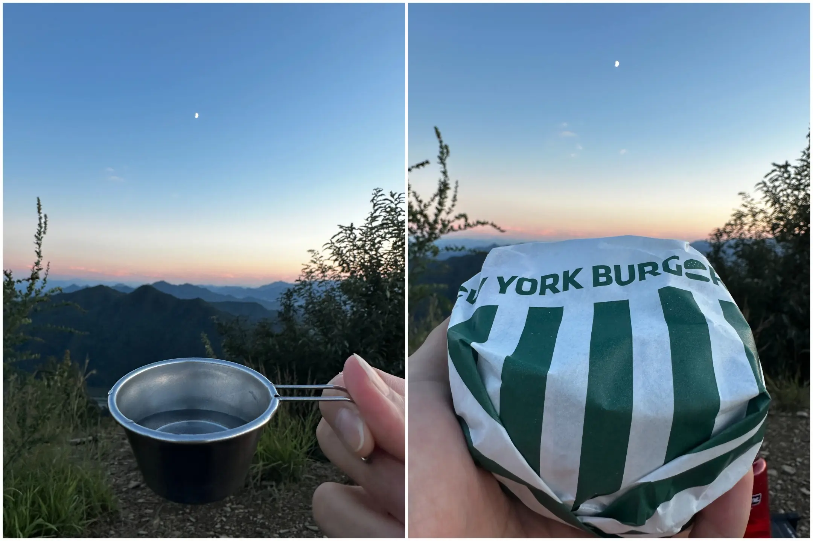

##### # 열심히 놀겠다는 다짐
선선한 날씨와 부쩍 높아진 하늘이 출근길마저 설레게 하던 가을 날, 서울 근교를 벗어나 멀리 떠나고 싶어졌다. 그래서 찾게 된 옥천 어깨봉. 일교차가 큰 가을에는 운해를 볼 수 있다기에 부푼 맘으로 여정을 시작했다.   

가는 길에 친구를 만나 점심을 먹기로 했다. 그렇게 대전에서 만난 오랜 친구 H. 밥을 먹으면서 근황을 물었는데 졸업 요건을 채워 내년에는 졸업을 할 수 있다고 한다. 6년제 학부에 박사까지 총 12년. 문득 내가 10년 넘게 꾸준히 해온 일이 있었던가 되돌아보니 새삼 그의 시간이 무겁게 느껴졌다. 이렇게 노는 것 만이라도 꾸준히 남겨보자고 다짐 해본다.  
  
{: .short-image}
  
놀고 먹다보니 세 시가 넘어 옥천으로 가는 무궁화호 열차를 탔다. 대전역에서 옥천역 까지는 단 12분. 느리게 변하는 풍경이 지루해지기 전 열차가 멈췄다.
  
{: .short-image}
  
옥천역 도착. 하지만 주변을 돌아볼 틈은 없었다. 하루 단 네 대만 운행하는 시내버스를 타기 위해 달려야 했기 때문이다. 열차가 멈추기 직전 실시간 정보를 확인하니 버스는 도착 3분 전. 평소 같았다면 느긋하게 다음 차를 기다렸을 텐데 다음이 없는 이런 경우는 뛸 수밖에. 심호흡을 하고 정류장을 향해 뛰었다. 뛰기 전 빠르게 한 컷.     

#### # 자차가 아니면 좀 어렵네요  
{: .long-image}
  
역에서 정류장 까지는 생각보다 멀지 않아 가까스로 세이프. 하지만 저녁으로 먹을 것을 사지 못했다. 어째야 하나 싶어 지도를 봤는데, 다행히 정류장 근처에 금강 휴게소가 있었다. 버스를 내려 금강 휴게소에 들리기로 결정. 청량한 바람을 맞으며 한 숨 돌리는 사이 버스는 구불구불한 국도를 따라 교외로 향했다.

> 어깨봉 가는 법 : 옥천옻문화단지소형주차장   
> 🚌 대중교통 이용 시 : 옥천역에서 시내버스 이용   
> &nbsp;&nbsp;&nbsp; 541번 서울정형외과앞 ↔ 조령리 (45분 소요, 하루 4회 운행)  
> 🚗 자차 이용 시 : 옥천옻문화단지소형주차장 이용
  
{: .short-image}
   
조령리 정류장까지는 40여분 정도 걸렸다. 자차로 20분이 채 걸리지 않는 거리를 이 마을 저 마을을 거쳐 오니 그럴 수 밖에. 오늘과 같이 시간이 촉박할 때면 자차의 존재가 절실하다. 이가 없으면 잇몸으로, 차가 없으면 두 다리로. 다리야 힘을 내줘.  
  
금강 휴게소는 경부 고속도로 아래 연결로를 따라 들어 갈 수 있었다. 서둘러 편의점을 둘러봤는데 이게 무슨 일 이야. 살 만한 것이 없다시피 했다. 어묵 팩이나 레토르트 야식을 사려고 했는데, 아무래도 휴게소에서는 잘 팔리지 않나 보다. 어쩔 수 없이 푸드 코트에서 햄버거를 샀다. 

{: .short-image}
  
휴게소에서 볼 수 있는 금강 뷰. 물살이 제법 빠르다. 대청호 보다 더 상류 쪽이니 그럴 만 하다. 산 위에서 보는게 더 예쁠것 같아 미련 없이 등산로로 출발.  

{: .long-image}
  
왔던 길을 돌아 정류장 쪽으로 걸었다. 인도가 없으니 갓길로 조심조심!  

{: .short-image}
  
등산로 초입에 다다르면 이렇게 고속도로와 국도 사이의 주차장이 나온다. 아마도 예전 도로를 주차장으로 활용 중인 듯. 잠깐이지만 블럭을 넘어 안전하게 걸었다.
  
#### # 어깨산 정상까지
{: .short-image}
  
주차장 맡은 편에 공터가 등산로 입구다. 이렇게 화장실이 있으니 참고. 등산 안내도 뒤 경사로를 따라 올라가면 된다.  

{: .long-image}
  
어깨산 정상 까지는 1.5km 그다지 멀지 않은 걸?  

{: .long-image}
  
마음이 급해서 페이스를 올린 탓인지 등산로를 들어온 지 얼마 지나지 않아 숨이 찼다. 그래서 중간중간 숨을 고르면서 올라 온 길을 돌아 보았다. 오를 때는 그렇게 깎아지는 경사처럼 느껴지던 등산로가 거짓말처럼 완만해 보였다. "지나고 보면 별 거 아니더라." 를 몸으로 배운 느낌.  

{: .long-image}
  
금강 전망대 부터는 비교적 완만한 능선을 따라 이동했다. 어느새 도착한 어깨 갈림길. 임도 주차장에서 출발하면 더 짧은 산행이 가능할 것 같다. 다음에 차로 올 때에는 저 쪽에서 출발 해보기로.  

{: .long-image}
  
조금 더 올라가니 계단이 나왔다. 정말로 128단 인지 세어보며 올라가니 금방 올라

{: .long-image}
{: .long-image}
{: .short-image}
{: .long-image}
{: .short-image}
{: .short-image}
{: .long-image}
{: .long-image}
{: .long-image}
{: .long-image}
{: .short-image}
{: .short-image}
{: .short-image}
{: .short-image}
{: .short-image}
{: .short-image}
{: .long-image}
{: .long-image}
{: .long-image}
