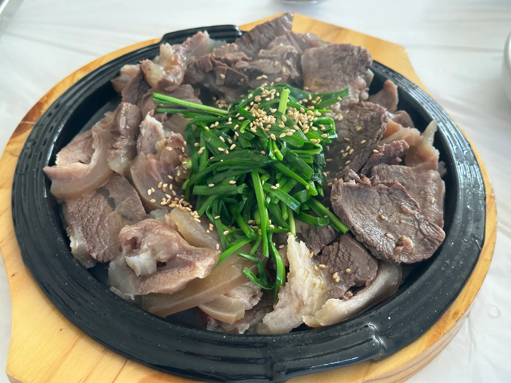

##### #작성중

##### # 오랜만에 어샘블
  
오랜만에 친구 C가 함께 백패킹을 가자고 제안했다. 개인 사정으로 한동안 백패킹을 못 가고 있는데 오랜만에 여유가 생겼나 보다. 이런 제안은 언제든 환영이야.   
마침 억새 시즌이라 전국 5대 군락지 중 한 곳인 오서산에 가보기로 했다. 전국구 억새 명소가 수도권에서 가까운 데다 짧은 트레킹 코스도 있다? 빠지는 게 없는 스펙에 고민 없이 결정! 그건 그렇고 도대체 전국 몇 대 타이틀은 누가 만드는 걸까?

{: .short-image}
    
점심즈음 C의 차를 타고 길을 나섰다. 이 날씨에 조수석에 앉아 드라이브라니 어찌 신나지 않을 수 있겠어요. 오늘의 선곡은 가을 날씨와 딱 맞는 8090 시티팝. 지금 들어도 어쩜 이렇게 세련될 수 있는지 감탄스럽다. 길이 막혀 도착 예상 시간이 점점 늘어났지만 오히려 좋아. 샴푸의 요정 한번 더 들을 수 있으니까~.😎
정체를 뚫고 광천 IC로 빠져나와 읍내에서 장을 봤다. 길이 생각보다 많이 막혔는지 벌써 해가 기울고 있었다. 혼자였다면 마음이 조급 했을 텐데, 일행이 있으니 마음이 한결 편했다.  
  
> 오서산 가는 법  
> 🚌 대중교통 이용 시 : 광천역/터미널에서 시내버스 이용, 정암사-정상 코스   
> &nbsp;&nbsp;&nbsp; 701번 광천터미널 ↔ 상담 (17분 소요)  
> &nbsp;&nbsp;&nbsp;광천 터미널 → 상담 : 06:10 / 09:10 / 14:00 / 17:40   
> &nbsp;&nbsp;&nbsp;상담 → 광천 터미널 : 12:10 (*2024.02월 기준)  
> 시간표는 <a href="https://www.hongseong.go.kr/tour/sub04_0804.do"> 홍성 관광 안내소</a> 에서 확인 할 수 있다.  
> "상담"or"701번" 검색  
> 🚗 자차 이용 시 : 오서산자연휴양림매표소 이용, 휴양림-정상 코스   

##### # 짧은 산행, 휴양림-정상 코스

{: .long-image}

우리는 부담이 적은 휴양림-정상 코스로 올라가기로 했다. 휴양림은 대중교통으로는 접근이 조금 어려워 만약 대중교통을 이용한다면 정암사-정상 코스를 타는 게 좋을 듯하다.  
매표소를 통과해 자연휴양림 내 주차장에 차를 대고 여유롭게 등반을 시작했다. 표지판이 곳곳에 설치되어있어 어렵지 않게 등산로를 찾을 수 있었다.

{: .long-image}
  
개천을 따라가다 큼직한 바위를 돌아 올라가면 월정사라는 조그만 사찰이 나온다. 대웅전과 카페 겸 종무소로 보이는 건물옆으로 색색의 꽃들과 키가 재각각인 장독들이 옹기종기 뭉쳐있는 모습이 귀여웠다. 시간이 되면 하산길에 쉬었다 갈까 생각했는데, 오전 등산객들로 붐벼 대웅전 사진만 간신히 하나 건져 하산했다.  

{: .long-image}
  
이렇게 등산로 쪽에 약수터가 있어 목을 축이고 다시 출발.  

{: .long-image}
  
절에서 조금 더 올라가니 갑자기 차가 다닐 수 있는 포장도로가 나타났다. 아마도 이 코스에서 차로 갈 수 있는 가장 높은 곳 인듯 했다. 어디서 올라왔는지 모를 차가 한 대 보였다. 하산객을 기다리고 있는 것 같았다. 그리고 그 너머 등산로부터는 경사가 조금씩 가팔라져 그나마 등산로 느낌이 났다. 날이 점점 어두워지고 있었다.  

##### # 
{: .long-image}
  

{: .long-image}

{: .long-image}

{: .short-image}

##### # 자리가 없어요

{: .long-image}

##### # 친구 따라 오디션 봤다가 합격한 기분?

{: .long-image}

{: .long-image}

{: .long-image}

{: .long-image}

{: .long-image}

{: .short-image}

{: .short-image}

{: .long-image}

##### # 드디어 억새 구경
{: .short-image}

{: .short-image}

{: .long-image}

{: .long-image}

##### # 호박 먹인 추어어죽의 원조, 광천원조어죽  

{: .short-image}

{: .short-image}

{: .short-image}

