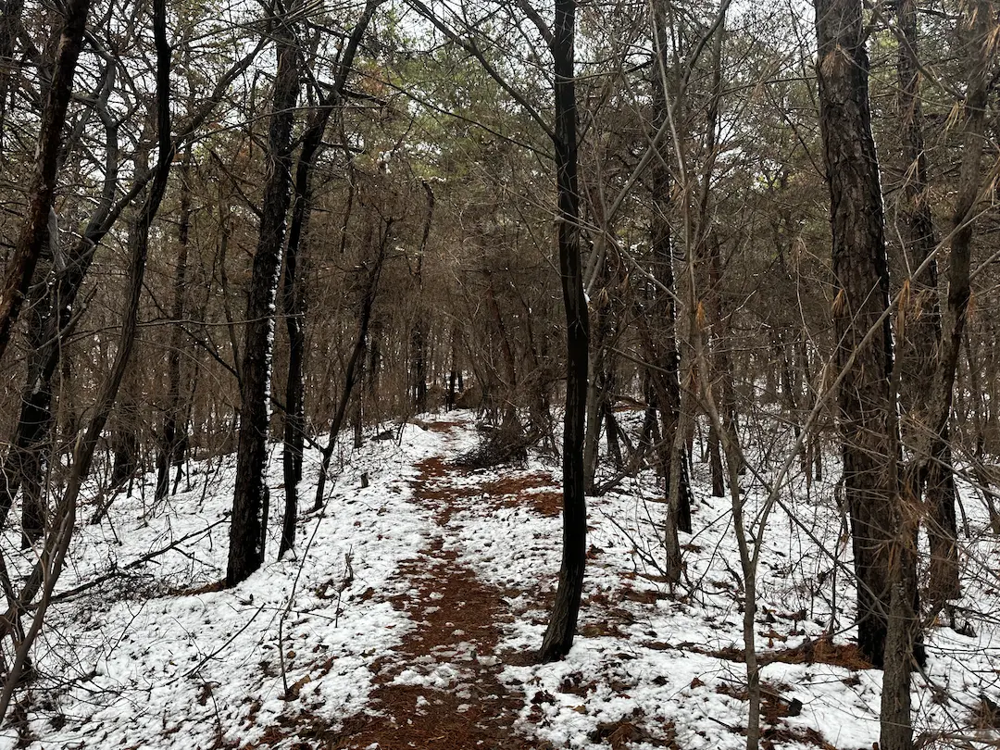
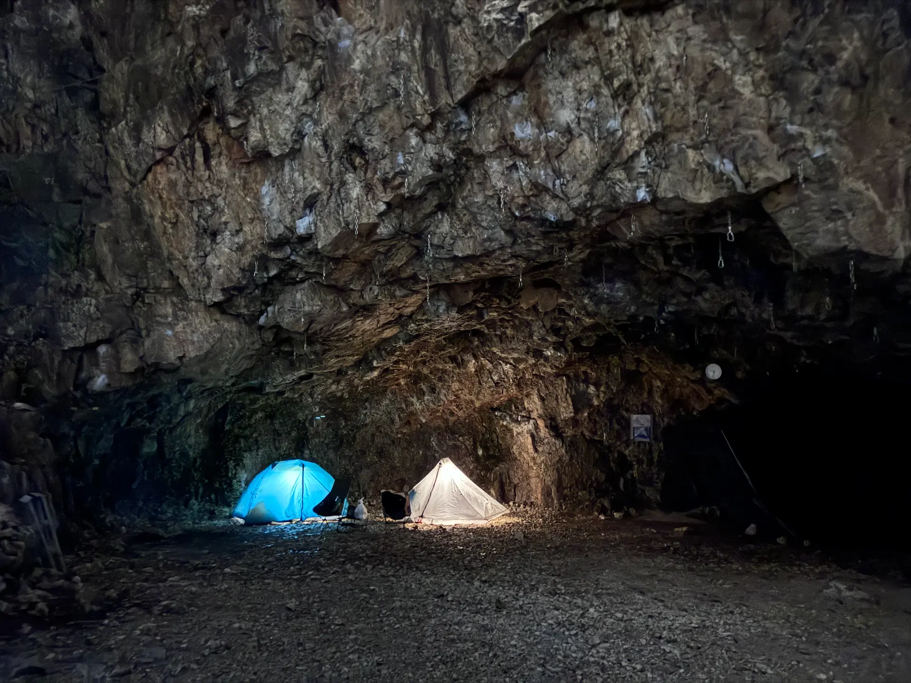

##### # 작성중

{: .short-image}

{: .short-image}

{: .short-image}

{: .short-image}

{: .short-image} 

{: .short-image} 

{: .short-image} 

{: .long-image} 

{: .short-image} 

{: .long-image}

{: .short-image} 

{: .short-image} 

{: .short-image} 

{: .short-image} 

{: .long-image}

{: .short-image}

{: .short-image}

{: .short-image} 

{: .long-image}
    

{: .long-image}
    
