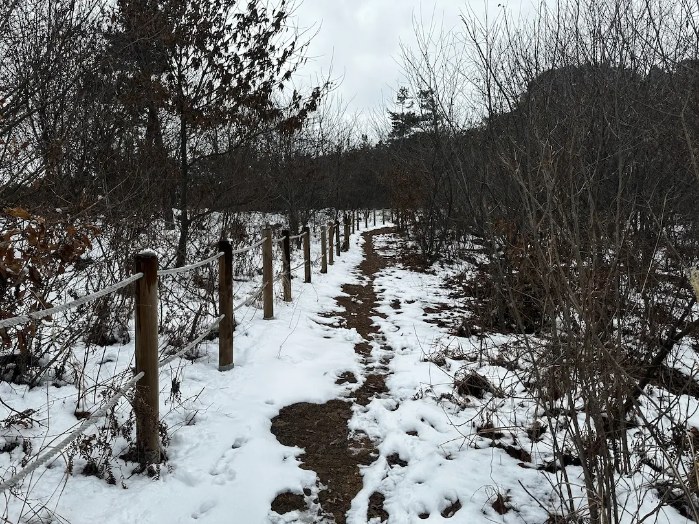

오래전 박지를 검색하다가 동굴에서 백패킹을 하는 사진을 보게 되었다. 너무 재밌을 것 같으면서도 어디 얼마나 먼 곳인가 하고 봤더니, 생각보다 너무 가까워 TOGO 리스트에 오른 용인 조비산. 어쩌다 보니 3트 만에 성공한 우당탕탕 조비산 백패킹 후기 시-작!
  
{: .short-image}  

##### # 클라이머와 백패커가 찾는 조비산
  
조비산은 천연 암벽이 있어 클라이밍 장소로 유명한 곳이다.  용인시 관리하에 암벽 등반을 위한 환경이 잘 조성되어 있고 등반 루트도 다양해서 인기가 많다고. 아닌 게 아니라 비수기인 1월 말 평일에 방문했을 때에도 클라이머 분들이 계셨다.  
한편으로 조비산은 백패커들에게도 상당히 매력적인 곳이다. 느린 걸음으로도 20분이면 정상에 닿을 수 있어 퇴근박을 하기에 좋고, 암벽 아래 천연 동굴 또한 이색 박지로 손색이 없기 때문이다.  

##### # 삼고초려 : 한 번의 펑, 한 번의 철수
  
{: .short-image}
  
코스가 어려운 것도 아니고 박지가 부족한 것도 아닌데 왜 삼고초려를 하게 되었나 하면 얘기는 이렇다.  
첫 번째 계획은 함께 가기로 한 친구가 전날 약속을 취소했다. 그래서 솔캠으로 목적지 변경.  
두 번째 계획의 변고는 놀랍게도 박지에서 생겼다. 정상을 둘러보고 내려와 텐트를 막 치던 때 친구에게 급한 사정이 생긴 것. 뚜벅이인 본인은 돌아갈 길도 막막했고 동굴에 혼자라니 갑자기 조금 무서워져 같이 철수 했다. 미처 완성하지 못한 텐트 사진을 보니 그날의 황망함이 다시 떠오르는군.   
아무튼 이러한 이유로 이번 후기는 한 달 터울의 사진이 섞여 있다.  

##### # 정상까지 단 20분

> 조비산 가는 법  
> 🚌 대중교통 이용 시 : 죽산시외버스터미널/백암터미널에서 택시,시내버스 이용  
> &nbsp;&nbsp;&nbsp;105번 백암터미널 ↔ 용천2리  
> &nbsp;&nbsp;&nbsp;10-4번 백암터미널 ↔ 장평삼거리  
> &nbsp;&nbsp;&nbsp;시간표는 <a href="https://www.gbis.go.kr/"> 경기 버스정보</a> 에서 확인 할 수 있다.    
> 🚗 자차 이용 시 : 조비산가든 주변 주차 (등산객 주차X)  
  
죽산 터미널이 상대적으로 차편이 많은데, 시내버스 이용 시 한 번 환승이 필요해 시내버스 이용이 어려워 보인다. 백암 터미널은 차편이 적지만 시내버스 이용이 상대적으로 용이하다. 나는 더더더 용이한 자차를 이용했다.  
  
{: .short-image}
  
{: .short-image}
  
조비산가든 앞 주차장은 식당 방문객 외에는 주차를 금지하고 있다. 그래서 조비산가든 진입로에 주차를 하고 가든 앞 등산로로 이어지는 계단을 따라 산행을 시작했다. 정상까지는 약 20여분 소요.  
  
{: .short-image} 
  
이틀 전 눈이 많이 와 등산로 초입이 눈으로 덮여있었다. 포근한 날씨에 나뭇가지에 걸린 눈들이 요란한 소리를 내며 떨어지고, 무게를 이기지 못한 가지들은 부러져 길이 어수선했다.  
나뭇가지를 치우며 올라가다 보니 등산로 옆으로 잘 정돈된 산소가 보였다. 나는 산소를 지날 때 실례합니다 하고 혼잣말을 하는데 그러면 뭔가 오싹함이 가신다. 그냥 그렇다구요.
  
{: .short-image} 
  
정상 표지판을 따라 조금만 더 걷다 보면 금새 동굴 도착. 눈이 많이 내린 후여서 인지 아무도 없었다. 덕분에 사방이 조용-해서 동굴 천장에서 물방울 떨어지는 소리가 우렁차게 들렸다.  
  
{: .long-image} 
  
짐을 내려놓고 동굴 왼편으로 나 있는 길을 따라 정상으로 향했다.  
  
{: .long-image}
  
동굴에서 정상까지는 가파른 계단으로 이어져 있는데 그나마도 짧아 숨이 찰 때쯤 정상에 도착할 수 있었다. 조비산 정상비. 몽글몽글 귀엽다.  
    
{: .short-image} 
  
정상비를 조금 지나면 전망대가 있다. 높은 산이 아닌데도 주변에 시야를 가리는 것이 없어 경치가 제법 괜찮다. 전망대 데크는 텐트 네댓 동은 거뜬히 칠 수 있을 것 같았다.  
  
{: .short-image} 
  
전망대 뷰. 인근의 논밭과 물류 창고들이 보인다. 좋지도 나쁘지도 않은 경치. 날이 흐리고 바람이 강해 얼른 내려왔다.  
  
##### # 살 찌는 시간  
  
{: .short-image} 
  
텐트를 치기에는 조금 이른시간어서 동굴 앞에서 막걸리 한 잔 걸쳤다. 역시 막걸리는 지역색이 강해서 좋다. 마트에서 맛동산이 눈에 들어왔다 = 나이가 들었다. 숨길 수 없는 아저씨 스웨그🥺 

{: .short-image} 
  
더 추워지기 전에 텐트를 쳤다. 건조한 동절기임에도 동굴 내부는 습기가 올라와 입구 쪽에 자리를 잡았다. 사실 안쪽은 좀 어둡기도 해서 살짝 겁이 나기도 했어. 이건 1월 철수 직전에 찍은 사진. 2월에 갔을 때는 눈이 녹아 동굴 천장에서 어디라고 할 것 없이 물이 뚝뚝 떨어졌다. 눈비 온 다음날은 이럴 수 있으니 참고.

{: .long-image}

저녁은 백암면이 가까워 유명한 백암 순대를 포장해 왔다. 1월엔 백암식당, 2월엔 제일식당. 나는 백암식당 순대를 못 먹어봤지만, 둘 다 먹어본 친구 말로는 비슷비슷하다고. 푸짐한 양에 덩달아 푸짐해져 버린 나. 잘 먹었습니다.

##### # 동굴에서의 무서운? 하룻밤  
{: .short-image}
  
이 뷰를 위해 여기 온 게 아닐까? 잠들기 전 열심히 찍어본 텐풍. 예쁘게 나와서 만족스럽다. 그런데 실제로는 훨씬 더 주변이 깜깜해서 좀 무서웠다. 동굴이 깊지 않다는 것을 아는데도 뭔가 음산하다고 해야 하나. 다른 팀이 있었으면 안 무서웠을 텐데 싶었다. 무서울 땐 침낭 속에 숨어야지. 호다닥 텐트로 들어가 물이 똑- 똑- 하고 떨어지는 소리를 들으며 잠에 들었다.  

{: .short-image} 
  
눈을 뜨니 일출 10분 전. 밤새 떨어진 물줄기가 얼어붙어 고드름이 되어 있었다. 지퍼까지 물에 젖었는지 문을 열 수가 없었다. 정상에 가볼까 하다가 이걸 핑계로 스킵. 다시 애벌레가 되었다.    

{: .short-image} 
  
느지막이 일어나 짐을 정리했다. 나와보니 구름이 두껍게 깔려 있었다. 이 정도면 분명 일출도 안보였을 것이라는 생각이 들자, 기분이 좋아졌다. 오늘만큼은 게으름뱅이 1승! 아무튼 어찌어찌 우당탕탕 삼고초려 조비산 백패킹, 기분 좋게 끝!  