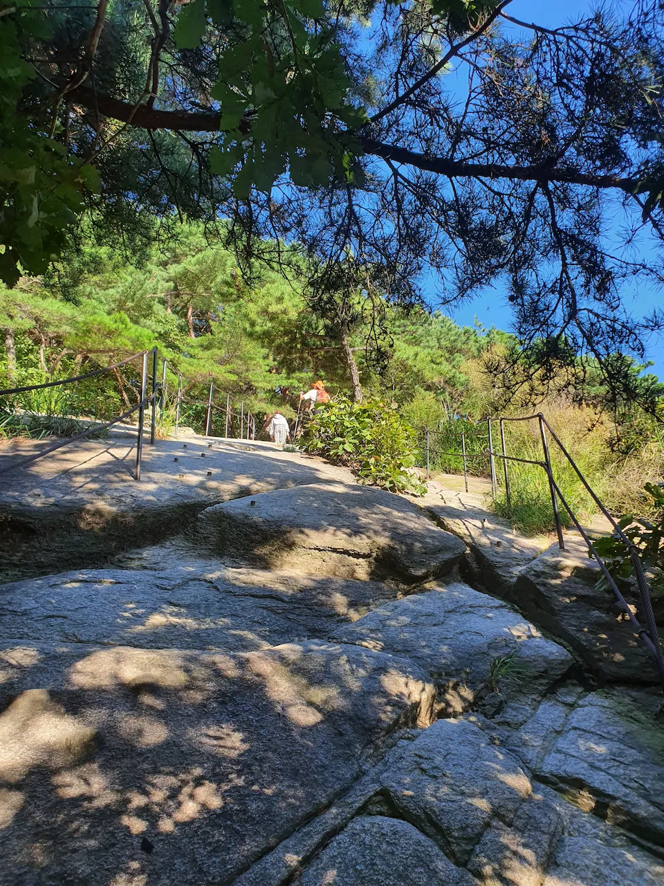
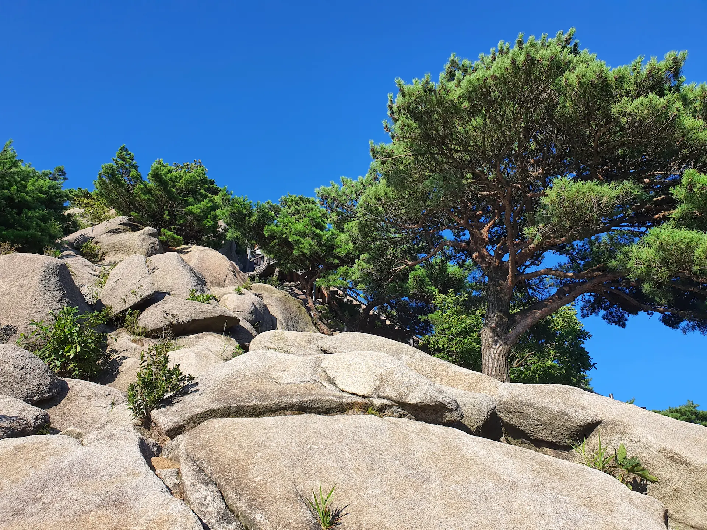

##### # 작성중

{: .long-image}

{: .short-image}

{: .long-image}

{: .short-image}

{: .long-image}

{: .long-image}

{: .long-image}

{: .short-image}

{: .long-image}

{: .short-image}

{: .short-image}

{: .short-image}

{: .short-image}

{: .long-image}

{: .long-image}

{: .short-image}

{: .short-image}

{: .long-image}

{: .short-image}

{: .short-image}

{: .short-image}

{: .long-image}

{: .short-image}

{: .short-image}

{: .short-image}

{: .long-image}

{: .long-image}

{: .long-image}

{: .short-image}

{: .short-image}