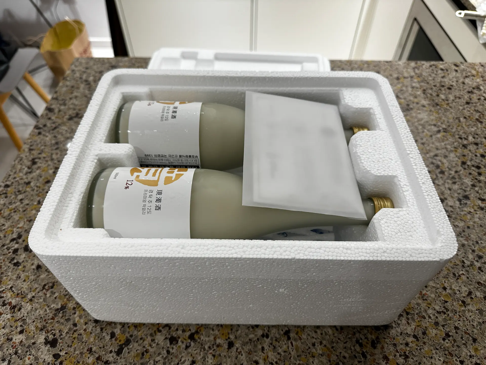
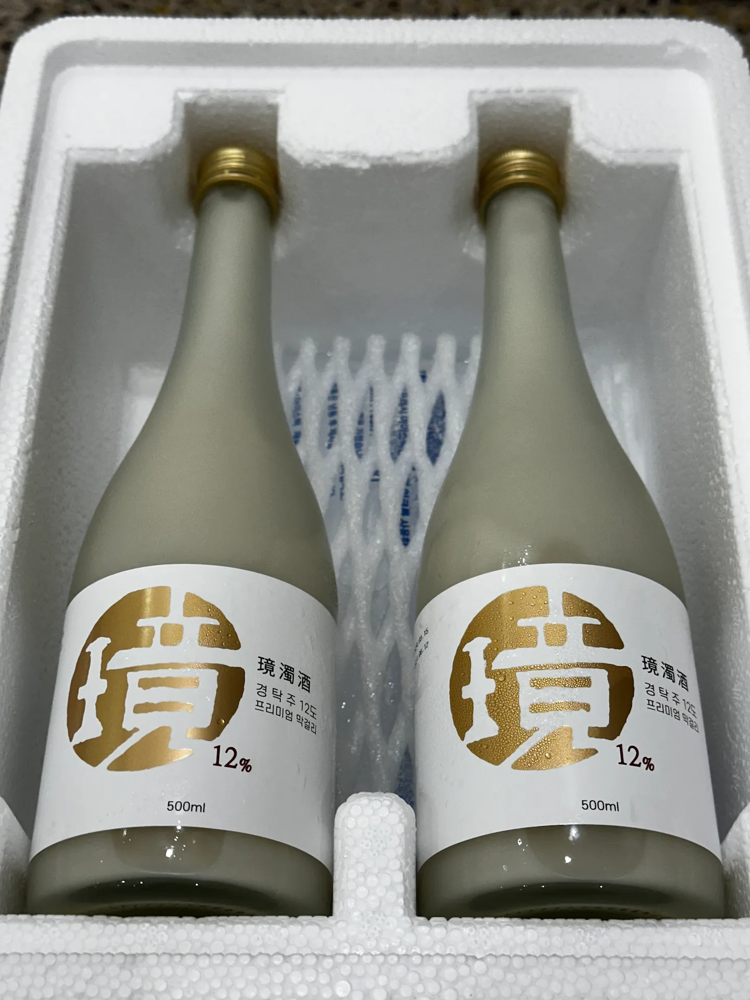
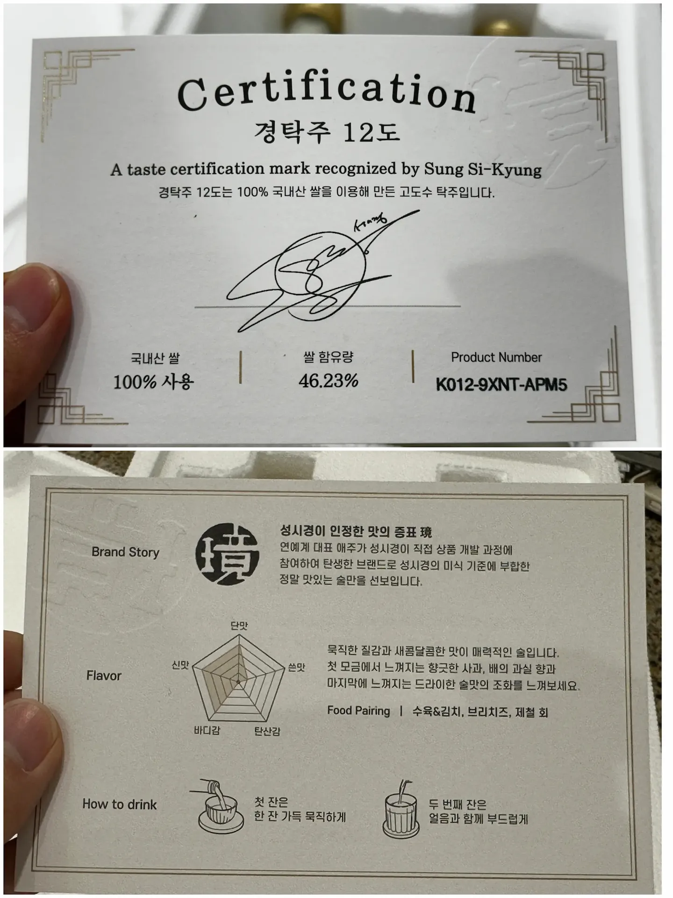
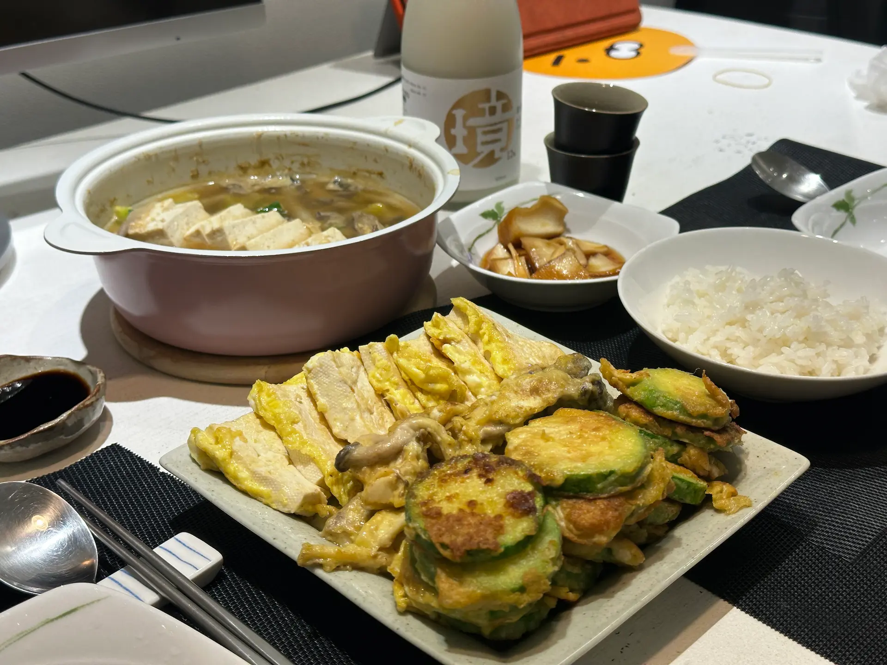
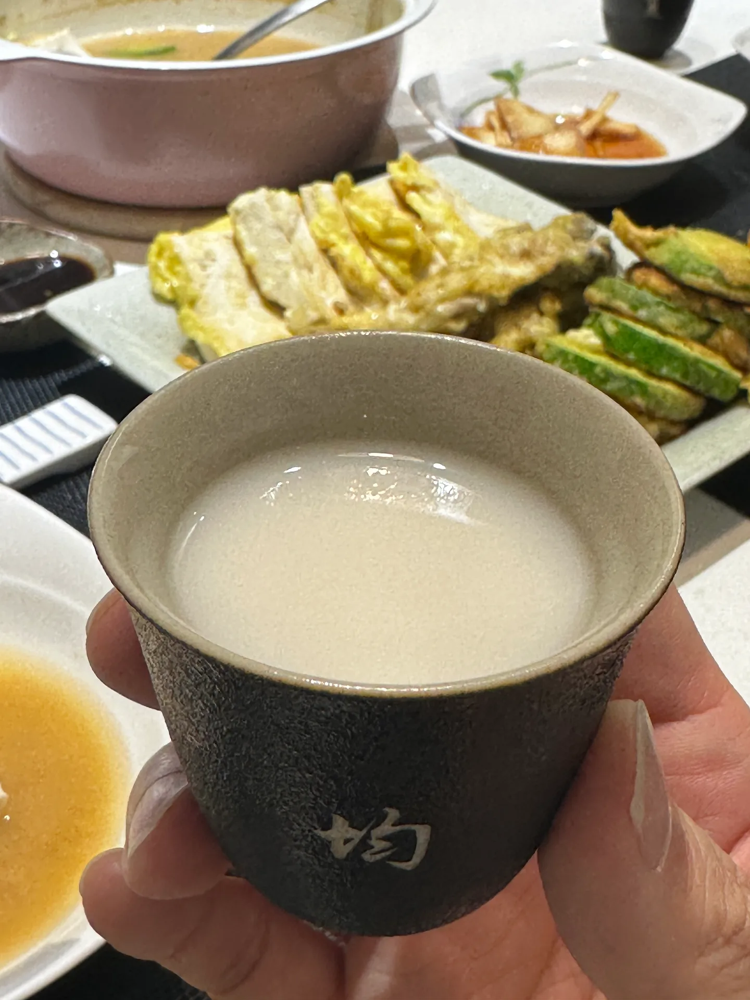

##### # 열심히 살지 않고도 힙해지는 법
신나게 퇴근을 준비하던 금요일 오후, 오랜만에 사촌 동생에게 연락이 왔다.  
"형아 혹시 경탁주 아나? 먹어보실?"  
어디서 들어본 거 같다 싶어 찾아보니 최근 성시경이 브랜딩한 막걸리였다. 얼마 전 술자리에서 구하기 어렵다는 얘기를 들었는데, 갑자기 보내준다고 주소를 알려달라는 동생. 힙해지고 싶은 나는 냉큼 주소를 불러드렸다. 열심히 살지 않고도 힙해지는 법 : 좋은 사촌 동생을 두세요.   

##### # 생각보다 더 구하기 어려운 듯?
> 경탁주 구매처  
<a href="https://smartstore.naver.com/j1inc"> 제이1 농업회사 법인 스마트스토어 </a> 에서  
> 평일 오전 11시 (주말, 공휴일 제외) 오픈  
> 판매 일정 변경은 <a href="https://smartstore.naver.com/j1inc/notice/list?cp=1"> 공지사항 </a> 참고  
  
경탁주는 현재 스마트 스토어에서 판매 중이며 평일 11시에 제한된 수량이 풀리고 있다. 몇 번 사보려고 했는데 아 맞다! 하고 11시가 살짝 지나 접속해 보면 Sold out. 인기가 상당하다. 2월 말 출시 되었으니 두 달이 조금 지난 시점에도 여전히 조기 완판을 기록하고 있는 셈. 구매를 위해서는 조금 더 부지런해져야겠다.  

##### # 언박싱

{: .short-image}
  
주말 지나 바로 배송이 왔다. 싱글벙글 언박싱! 스티로폼 박스를 열면 이렇게 술과 함께 카드가 동봉되어 있다. 
  
{: .long-image}
  
냉장 포장으로 유리병 표면에 물방울이 맛있게 맺혀있다. 아무래도 탁주라 냉장 배송이 필요한 듯.  

{: .long-image}
  
카드에는 경탁주의 맛에 대한 설명과 마시는 방법이 나와 있다. 100% 국내산 쌀을 쓴 고도수 탁주. 막걸리가 보통 6도 정도 하니까 확실히 도수가 높은 편. 새콤달콤한 맛, 과실 향과 묵직한 질감이 특징이며 첫 잔은 샷으로 두 번째 잔은 언더락으로 마셔보길 권하고 있다. 가이드 대로 마셔보기로.  

##### # 그래서 맛은

{: .short-image}
  
마침 비가 와서 간단히 전을 부쳐 페어링해 봤다. 비 오는 날엔 역시 지짐이지. 잘 먹겠습니다 :D

{: .long-image}
  
샷으로 한 잔. 달달하고 묵직한 질감이 인상적이다. 다이어그램을 보고 예상은 했지만, 생각보다 더 달아서 디저트 와인 같은 느낌이 났다. 그래서 얼른 언더락으로 마시기 시작. 반주를 하기에는 언더락이 훨씬 내 취향이었다. 녹진한 느낌이 좋아서 마지막은 다시 샷으로 마무리.  

##### # 나의 최애 레시피 - 경탁주 밀크
{: .long-image}
  
같이 자리한 귀인께서 베일리스 같이 우유나 커피와도 잘 어울릴 것 같다고 하셔서 바로 도전. 기대 이상의 퍼포먼스로 나머지는 모두 이렇게 마셨다. 개인적으로 5:5 비율을 추천. 언더락으로 마실 때 보다 특유의 질감이 더 살아있고 달달함도 밸런스 있게 잡혀서 좋았다.  
  
나는 자칭 탁주 애호가로서 탄산감이 있어 목 넘김이 좋은 탁주를 좋아한다. 그런데도 불구하고 경탁주 12도가 가진 묵직한 느낌이 싫지 않았다. 괜히 주류 대상을 수상한 게 아니라구~  
성시경 유튜브 채널에서 "탄산감 있는 마시기 쉬운 6도 막걸리"도 출시 계획이 있다고 한 만큼 "경탁주 6도" 출시를 기대하며 경탁주 12도 리뷰 끝!  
